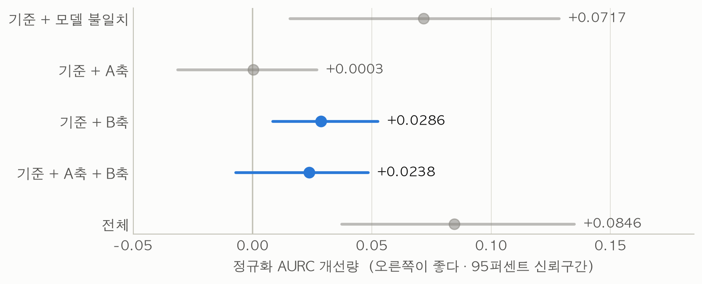
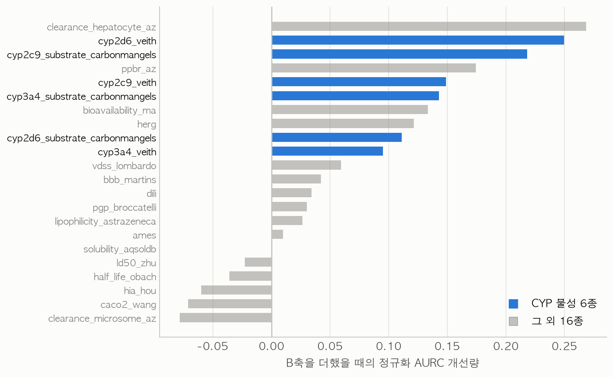
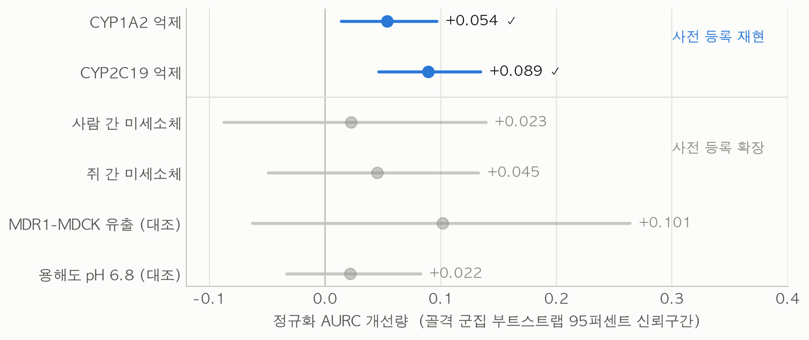

# MIST — 같은 분자를 다르게 적으면 모델이 답을 바꾼다

**M**olecular **I**nput-**S**tate sensi**T**ivity · 입력 상태 민감성을 ADMET 예측의 신뢰성 신호로 쓸 수 있는가

[**데모 열기**](https://mist-506994380250.asia-northeast3.run.app) · [**최종 보고서**](docs/최종보고서_MIST.md) · [연구계획서](docs/연구계획서.md)

TOBIG's 심화세션 2026 · 4인 · 2026년 8월 착수

---

## 무엇을 묻는가

ADMET 예측 모델은 평균 정확도로 평가받는다. 그런데 실무에서 필요한 것은 눈앞의 분자 하나에 대한 예측을 믿어도 되는지다. 지금 쓰이는 신뢰성 지표는 전부 **모델 쪽**에서 나온다. 학습 데이터와 얼마나 닮았는지(적용가능도메인), 모델이 스스로 얼마나 자신 없어 하는지(컨포멀)를 본다.

이 연구는 **입력 쪽**에서 신호를 찾는다. 같은 화합물도 컴퓨터에 넣을 때는 표기가 여럿이고 화학적 상태도 여럿이다. 호변이성질체, 양성자화 상태, 입체 표기를 바꿔 넣었을 때 예측값이 크게 변한다면 그 예측은 덜 믿을 만하다는 가설이다.

| 축 | 무엇을 재나 | 성립 조건 |
| --- | --- | --- |
| **A · 표현 불안정성** | 같은 분자를 등가 SMILES로 다시 적었을 때의 예측 변동 폭 | SMILES를 읽는 언어 모델에서만 |
| **B · 입력 상태 민감성** | 호변이성질체·양성자화·입체 표기를 바꿨을 때의 변동 폭 | 모든 모델에서 |

1차 가설은 B축이다. A축은 선행 연구(Maxsmi, 2021)가 다룬 영역이라 참신성이 약하고 언어 모델이 있어야만 0이 아닌 값이 나온다.

---

## 결과

TDC ADMET 물성 22종, 골격 기반 분할, 정규화 AURC로 평가했다. 0이 완벽한 선별이고 1이 무작위다. 낮을수록 좋다.



| 구성 | AURC 개선 | 95퍼센트 신뢰구간 | 개선 물성 |
| --- | --- | --- | --- |
| 기준 + 모델 불일치 | +0.0717 | [+0.0156, +0.1285] | 17/22 |
| 기준 + A축 | +0.0003 | [−0.0310, +0.0273] | 14/22 |
| **기준 + B축** | **+0.0286** | **[+0.0088, +0.0533]** | 14/22 |
| 전체 | +0.0846 | [+0.0374, +0.1350] | 18/22 |

기준 모형은 계획서가 지정한 적용가능도메인과 컨포멀이다. **B축을 더하면 신뢰구간이 0을 배제한다.** 골격 군집 단위로 재표집해도 [+0.0031, +0.0561]로 유지된다. A축 단독은 그렇지 않아 2차 가설은 지지되지 않는다.

모델 불일치는 계획서 기준에 없지만 우리보다 2.5배 강한 신호다. 감추지 않고 함께 싣는다.

### 효과는 CYP 물성에 집중되어 있다



| | AURC 개선 | 개선 물성 |
| --- | --- | --- |
| **CYP 6종** | **+0.080** | **6/6** |
| 그 외 16종 | +0.009 | 8/16 |

표본 수 문제가 아니다. CYP 기질 3종은 시험 분자가 66개뿐인데도 모두 개선됐고, CYP가 아닌 물성 중 표본이 가장 큰 넷(ames, ld50, 친유성, 용해도)은 0/4로 하나도 개선되지 않았다.

CYP만 떼어 단독 성능으로 보면 B축(0.711)이 컨포멀(0.724)·모델 불일치(0.767)·적용가능도메인(0.878)을 모두 앞선다.

### 새 데이터에서 재현됐다

CYP 집중은 결과를 보고 발견한 패턴이다. 그래서 구성과 판정 기준을 문서로 고정해 커밋한 뒤, 22종에 쓰이지 않은 데이터에서 **한 번만** 평가했다.



| 물성 | 1차 비교 | 골격 신뢰구간 | 판정 |
| --- | --- | --- | --- |
| CYP1A2 억제 | **+0.054** | [+0.014, +0.097] | 재현 성공 |
| CYP2C19 억제 | **+0.089** | [+0.046, +0.134] | 재현 성공 |
| Biogen 4종 (CYP 관련 2 + 대조 2) | +0.022 ~ +0.101 | 전부 0 포함 | 확장 부분 성공 |

Biogen에서는 네 물성 모두 양수였지만 **대조 물성이 CYP 관련 물성보다 크게 나왔다.** 사전 기록에 "대조에서도 같은 크기면 CYP 특이성 주장은 성립하지 않는다"고 적어뒀고, 그 경우에 해당한다. 구성을 바꿔 다시 돌리지 않고 이대로 보고한다.

---

## 결론

> **입력 상태 민감성은 CYP 억제 예측에서 기존 신호에 더해 위험 선별을 개선하는 신호이며, 범용 신뢰성 지표로 쓰기에는 근거가 부족하다.**

주장할 수 있는 것과 없는 것을 갈라 적는다.

| | |
| --- | --- |
| **주장한다** | 사전 지정한 1차 가설이 지지된다 · 기존 신호와 원천이 다르다(순위 상관 −0.09 ~ +0.11, 골격 거리와 **반대** 방향) · CYP에서 유효하며 독립 데이터 두 종에서 재현됐다 · 안전 인증에 강하다(오류율 0.46배 → 0.39배) |
| **주장하지 않는다** | 범용 신뢰성 지표 · 기존 신호의 대체 · CYP 관련 물성 전반으로의 확장 · CYP에서 잘 되는 이유(사전 등록한 설명 가설이 기각됐다) |

효과가 없었던 시도 일곱 가지도 보고서 8절에 그대로 실었다. 같은 길을 다시 걷지 않게 하기 위해서다.

---

## 검증 규율

사후 해석을 막기 위해 **결과를 보기 전에 구성과 판정 기준을 커밋했다.** 커밋 시각이 증거다.

| 사전 기록 | 물음 | 결과 |
| --- | --- | --- |
| [`사전기록_1_민감도_조절분석.md`](docs/사전기록_1_민감도_조절분석.md) | 상태 민감도가 CYP 집중을 설명하는가 | **기각** (ρ = −0.28, p = 0.81) |
| [`사전기록_2_CYP_재현.md`](docs/사전기록_2_CYP_재현.md) | CYP1A2·CYP2C19에서 재현되는가 | **성공** |
| [`사전기록_3_Biogen_확장.md`](docs/사전기록_3_Biogen_확장.md) | CYP 대사 물성으로 확장되는가 | **부분 성공** |

그 밖에 지킨 규율은 세 가지다.

- **분할 순서.** 부모 분자 확정 → 중복 제거 → 골격 기반 분할 → 그 다음에 변형 생성. 순서를 바꾸면 누출이 생긴다.
- **골격 군집 부트스트랩.** 분자가 아니라 골격 군집을 재표집한다. 규칙은 재적합하지 않는다.
- **효과 크기와 신뢰구간으로 판정.** p값을 1차 근거로 쓰지 않는다.

---

## 데모

**https://mist-506994380250.asia-northeast3.run.app**

분자 하나를 넣으면 변형을 만들어 두 모델로 채점하고, 어느 변형이 예측을 바꿨는지 구조로 보여준다. 달라진 원자는 색으로 표시한다.

물성 6종을 싣는다. B축이 잘 작동하는 CYP 둘과 거의 작동하지 않는 넷을 함께 둔다. **신호가 언제 작동하지 않는지도 보여주는 것이 이 도구의 목적이다.** 세 축을 하나의 점수로 합치지 않는다.

Cloud Run 최소 인스턴스는 0이라 접속이 없으면 비용이 발생하지 않는다. 첫 요청은 콜드 스타트로 느릴 수 있다.

---

## 저장소 구조

```
docs/          보고서·계획서·사전 등록 기록, 본문 그림(figures/)
scripts/       변형 채점, 신호 산출, 제거 실험, 재현 평가 (46개)
demo/          FastAPI 백엔드 + 정적 화면, Cloud Run 배포 설정
notebooks/     탐색용
data/          git 추적 안 함. scripts로 재생성한다
```

주요 스크립트만 짚으면 이렇다.

| 스크립트 | 몫 |
| --- | --- |
| `score_variants_fingerprint.py` · `score_variants_chemberta.py` | 변형별 예측 채점 |
| `run_preregistered_ablation.py` | 사전 지정 제거 실험 (표제 결과) |
| `run_expanded_ablation.py` | 22종 확대판 |
| `run_b1_statistics.py` | 골격 부트스트랩·BH 보정·MAD 민감도 |
| `run_replication_eval.py` | 사전 등록 재현 평가 |
| `run_moderator_sensitivity.py` | 상태 민감도 조절 분석 |
| `prepare_new_dataset.py` | 새 데이터 중복 제거 + 골격 분할 |
| `make_report_figures.py` | 보고서 그림 R1~R4 |

---

## 재현

```bash
python3.12 -m venv ~/.venvs/mist
~/.venvs/mist/bin/pip install -r requirements.txt
```

데이터는 저장소에 없다. `scripts/download_admet.py`로 TDC에서 받은 뒤 변형 생성 → 채점 → 평가 순으로 돌린다. 순서와 인자는 [`docs/실행계획.md`](docs/실행계획.md)에 있다.

ChemBERTa 경로는 `torch`·`transformers`가 필요하다. 지문 모델만으로도 B축 결과는 재현되며, 그 경로는 두 패키지 없이 돌아간다.

데모는 이렇게 띄운다.

```bash
cd demo/app && ~/.venvs/mist/bin/python -m uvicorn api:app --port 8811
```

---

## 산출물 위치

코드는 이 저장소, 데이터와 중간 산출물은 팀 Google Drive에 둔다.

| 위치 | 내용 |
| --- | --- |
| `Main/보고서/` | 최종 보고서(Markdown·HTML)와 본문 그림 |
| `Main/결과표/` | 표제 수치를 담은 CSV·JSON 12종 |
| `Main/사전등록/` | 사전 기록 3건 |
| `Main/보관/` | 8~9월 중간 산출물 |

---

## 역할

| 담당 | 몫 |
| --- | --- |
| 담당1 · 윤수 | 데이터 정리, 골격 분할, 변형 생성, 허용성 판정, 계층적 분산 분해 |
| 담당2 · 지예 | 예측 모델(지문·ChemBERTa), 컨포멀, 적용가능도메인 |
| 담당3 · 영주 | 통계 절차 정합 — 골격 부트스트랩, BH 보정, MAD 민감도 |
| 담당4 · 주형 | 통합·평가, 분할 규율 감사, 데모, 사전 등록 검증 |

---

## 남은 과제

| 과제 | 내용 |
| --- | --- |
| 검정력 확보 | Biogen 확장을 시험 비율을 높여 재설계. 새 사전 기록이 필요하다 |
| 구조 기반 모델 | Chemprop(D-MPNN)에서 B축 검증. 지문 모델에서 강했으므로 기대할 근거가 있다 |
| CYP 집중의 기전 | 이온화 민감도로는 설명되지 않았다. 다른 가설이 필요하다 |
| 재현 패키지 | `run_all.sh` 정비 |
